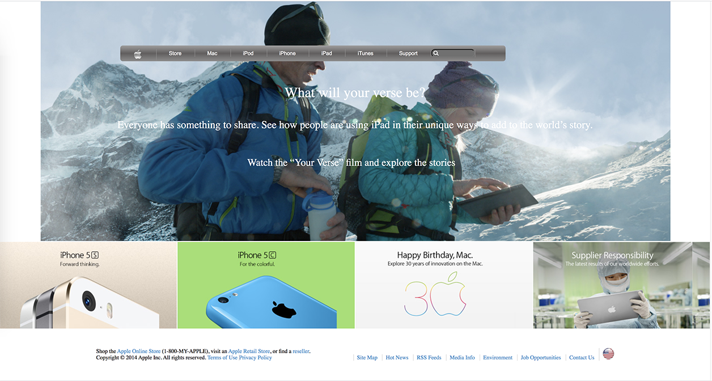

# Building with Backgrounds and Gradients(float, flex and grid)

> Microverse School > 4. HTML & CSS3 > Building with Backgrounds and Gradients

Microverse Collaborative Project (Ramin and Umair)

Additional description about the project and its features.

## Built With

- HTML,
- CSS,

## Live Demo

[Live Demo Link](https://rawcdn.githack.com/RaminMammadzada/building-with-backgrounds-and-gradients/1966b3292c77d2fd517871cba9f118e4a8d1b9ac/index.html)

## Getting Started

**Navigation bar**
- Go to this old version of [apple.com](https://web.archive.org/web/20140301004610/http://www.apple.com/) and have a look around. The form isn’t exceptionally complicat
This project is a Clone of this webpage.
We have a cloned webpage built with following features:

1. Tricky navigation bar
2. Background Images using background-image property
3. Major use of Gradient colors
4. Thumbnail section
5. header section
6. Footer

To get a local copy  and to set it up and running follow these simple example steps.

### Prerequisites

- Browser
- Internet

- Download the code from repository (https://github.com/RaminMammadzada/building-with-backgrounds-and-gradients) and double click the index.html file

## Authors

👤 **Ramin Mammadzada**

- Github: [@raminmammadzada](https://github.com/raminmammadzada)
- Twitter: [@raminmammadzada](https://twitter.com/raminmammadzada)
- Linkedin: [raminmammadzada](https://linkedin.com/raminmammadzada) 
- Email: [raminmammadzadaiu@gmail.com](mailto:raminmammadzadaiu@gmail.com?subject=[GitHub]%20Source%20Han%20Sans)

👤 **Umair Arshad**

- Github: [@umairarshadbutt](https://github.com/umairarshadbutt)
- Twitter: [@its_UmairArshad](https://twitter.com/its_UmairArshad)
- Linkedin: [umair-arshad-butt](https://www.linkedin.com/in/umair-arshad-butt/)

## Show your support

Give a ⭐️ if you like this project!

## 📝 License

This project is [MIT](LICENSE) licensed.

